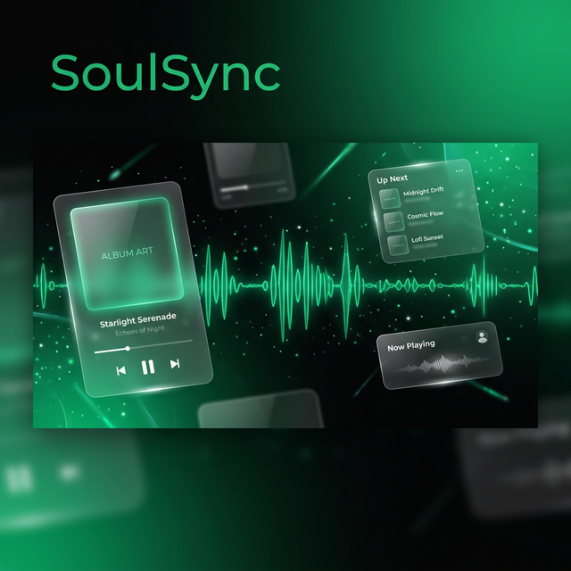

<div align="center">

<br/>



<br/><br/>

# 🎧 SoulSync

### Listen together. Feel together.

**AI-powered music streaming** · **Real-time SoulLink** · **Personalized dashboards** · **Offline downloads**

[](https://soul-sync-beta.vercel.app/)

<br/>


<br/><br/>

[Features](#-features) · [vs Spotify](#-soulsync-vs-spotify) · [AI Engine](#-ai-engine) · [SoulLink](#-soullink--listen-together) · [Tech Stack](#-tech-stack) · [Architecture](#-architecture) · [Setup](#-getting-started) · [Deploy](#-deployment) · [API Docs](#-api-reference)

</div>

<br/>

---

<br/>

<div align="center">
<table>
<tr>
<td align="center" width="25%">
<br/>
<strong>AI Playlists</strong><br/>
<sub>Describe a mood → get a<br/>curated playlist via LLaMA 3.3</sub>
</td>
<td align="center" width="25%">
<br/>
<strong>SoulLink</strong><br/>
<sub>Listen together in real-time<br/>with synced playback & chat</sub>
</td>
<td align="center" width="25%">
<br/>
<strong>Smart Dashboard</strong><br/>
<sub>Personalized home built from<br/>your history & preferences</sub>
</td>
<td align="center" width="25%">
<br/>
<strong>Offline Mode</strong><br/>
<sub>Download songs & import<br/>local files for offline play</sub>
</td>
</tr>
</table>
</div>

<br/>

---

## 🏆 SoulSync vs Spotify

> _Everything Spotify charges ₹119/month for — SoulSync gives you free. Plus features Spotify doesn't offer at any price._

<div align="center">

| Feature                    |       🟢 SoulSync       |  🔴 Spotify Free  |    🟡 Spotify Premium    |
| -------------------------- | :---------------------: | :---------------: | :----------------------: |
| **Ad-free listening**      |        ✅ Always        | ❌ Ads every song |         ✅ Paid          |
| **AI Playlist Builder**    |   ✅ Free, unlimited    | ❌ Not available  |     ❌ Not available     |
| **Listen Together (Duo)**  | ✅ Free + built-in chat | ❌ Not available  |     ✅ Paid, no chat     |
| **Song Downloads**         | ✅ Free, stored locally | ❌ Not available  |       ✅ Paid only       |
| **NLP Smart Search**       |     ✅ Intent-aware     |  ❌ Keyword only  |     ❌ Keyword only      |
| **Personalized Dashboard** |      ✅ From day 1      |    ❌ Generic     | ✅ Algorithmic black box |
| **In-session Chat**        |       ✅ Built-in       | ❌ Not available  |     ❌ Not available     |
| **Offline Playback**       |         ✅ Free         | ❌ Not available  |         ✅ Paid          |
| **Import Local Files**     |   ✅ MP3/WAV/FLAC/AAC   |       ❌ No       |          ❌ No           |
| **Open Source**            |     ✅ MIT License      | ❌ Closed source  |     ❌ Closed source     |
| **Monthly Price**          |     **₹0 forever**      |    ₹0 with ads    |      **₹119/month**      |

</div>

> 💬 **Bottom line** — SoulSync is what Spotify would look like if they actually cared about users more than revenue.

<br/>

---

## ✨ Features

<details>
<summary><strong>🔐 Authentication & Onboarding</strong></summary>

<br/>

| Feature               | Description                                                                                |
| --------------------- | ------------------------------------------------------------------------------------------ |
| **Google OAuth 2.0**  | One-tap sign-in via `@react-oauth/google`, verified server-side with `google-auth-library` |
| **JWT Sessions**      | httpOnly secure cookies with 7-day expiry, automatic renewal                               |
| **Guided Onboarding** | 4-step animated wizard — languages → eras → moods → profile name                           |
| **Protected Routes**  | `ProtectedRoute` wrapper redirects unauthenticated users to login                          |
| **User Profiles**     | Google photo, editable display name, language/mood/era preferences                         |

</details>

<details>
<summary><strong>🎵 Core Music Experience</strong></summary>

<br/>

| Feature                 | Description                                                                                         |
| ----------------------- | --------------------------------------------------------------------------------------------------- |
| **Millions of Songs**   | Full streaming powered by JioSaavn API across 10+ Indian languages & English                        |
| **NLP Smart Search**    | Understands artists, moods, languages, eras, movies, and formats (e.g., _"sad anirudh songs 2024"_) |
| **Search Enhancer**     | 500+ artist dictionary, mood tokenization, language detection, intent classification                |
| **HQ Playback**         | Auto-selects 320kbps → 160kbps → 96kbps based on availability                                       |
| **Queue Management**    | View, reorder, add next/last, shuffle, and auto-fill with recommendations                           |
| **Shuffle & Repeat**    | Shuffle mode, repeat-one, repeat-all, repeat-off                                                    |
| **Now Playing View**    | Full-screen immersive view with dynamic gradients, vinyl spin, and album art                        |
| **Context Menu**        | Right-click: Play, Queue, Add to Playlist, Like, Download, Go to Artist/Album                       |
| **Keyboard Shortcuts**  | Space (play/pause), arrows (seek/volume), M (mute), S (shuffle), R (repeat)                         |
| **Dynamic Backgrounds** | Album art color extraction for immersive gradient overlays                                          |

</details>

<details>
<summary><strong>🤖 AI-Powered Playlists</strong></summary>

<br/>

| Feature                   | Description                                                                         |
| ------------------------- | ----------------------------------------------------------------------------------- |
| **Mood-Based Generation** | Describe a vibe → Groq AI generates 15 matching songs with a creative playlist name |
| **Song List Mode**        | Paste song names → AI optimizes search queries and matches from JioSaavn            |
| **Smart Matching**        | Confidence scoring (high / partial / none) with relevance-based ranking             |
| **Multi-Key Rotation**    | Up to 5 Groq API keys with round-robin, rate-limit detection, auto fallback         |
| **Result Caching**        | AI responses cached in Redis for 30 min to save API calls                           |
| **One-Click Save**        | Review matches, deselect unwanted songs, save directly to your library              |

</details>

<details>
<summary><strong>🏠 Personalized Dashboard</strong></summary>

<br/>

Built dynamically from your **listening history**, **language preferences**, and **time of day**.

| Section                     | Description                                                                |
| --------------------------- | -------------------------------------------------------------------------- |
| 🎵 **Quick Grid**           | 6 recently played songs for instant replay                                 |
| 🔄 **Continue Listening**   | Last 10 songs with album art                                               |
| 🎤 **Artist Spotlight**     | Top listened artist with their songs                                       |
| 🌍 **Language Sections**    | Personalized sections in your preferred languages                          |
| ⏰ **Time-Based Mood**      | "Morning Fresh Hits", "Late Night Chill", etc.                             |
| 💡 **Because You Listened** | Recommendations based on recent tracks                                     |
| 📈 **Trending Now**         | Trending songs filtered by your languages                                  |
| 😊 **Mood Grid**            | Clickable mood cards — Happy, Heartbreak, Party, Chill, Workout, Rainy Day |
| 🆕 **New Releases**         | Latest songs in preferred languages                                        |

</details>

<details>
<summary><strong>📚 Library & Playlists</strong></summary>

<br/>

| Feature               | Description                                                           |
| --------------------- | --------------------------------------------------------------------- |
| **Cloud Playlists**   | Create, edit, delete, reorder — stored in MongoDB, synced everywhere  |
| **AI Playlists**      | Save directly from AI modal with auto-generated names and tags        |
| **Liked Songs**       | Cloud-synced hearts with localStorage fallback for offline resilience |
| **Recently Played**   | Persistent 20-song history with deduplication                         |
| **Listening History** | Full play log with 90-day TTL auto-cleanup in MongoDB                 |
| **Playlist Page**     | Song list, total duration, drag-reorder, batch operations             |

</details>

<details>
<summary><strong>📥 Offline Downloads</strong></summary>

<br/>

| Feature                | Description                                                       |
| ---------------------- | ----------------------------------------------------------------- |
| **IndexedDB Storage**  | Songs saved locally with separate blob + metadata stores          |
| **One-Click Download** | Download any song from context menu or player                     |
| **Import Local Files** | File picker for MP3/WAV/AAC/OGG/FLAC with auto-duration detection |
| **Offline Playback**   | Play downloaded songs without internet via blob URLs              |
| **Storage Dashboard**  | View total storage used, remove individual songs                  |

</details>

<details>
<summary><strong>👤 Profile & Stats</strong></summary>

<br/>

| Feature                | Description                                              |
| ---------------------- | -------------------------------------------------------- |
| **Profile Page**       | Google avatar, editable name, preference tags            |
| **Listening Stats**    | Total songs played, total listening time, liked count    |
| **Top Artists**        | Aggregated from history with play counts and album art   |
| **Language Breakdown** | Listening distribution by language                       |
| **Edit Preferences**   | Modify languages/eras/moods — triggers dashboard rebuild |

</details>

<details>
<summary><strong>📱 Responsive & Premium UI</strong></summary>

<br/>

| Feature              | Description                                                                   |
| -------------------- | ----------------------------------------------------------------------------- |
| **Desktop**          | Sidebar + main content + now-playing + queue sidebar                          |
| **Mobile**           | Bottom nav, full-screen panels, safe area support                             |
| **Glassmorphism**    | Frosted glass panels, gradient overlays, blur effects                         |
| **Animations**       | Framer Motion fade/slide/scale, vinyl spin, equalizer bars, shimmer skeletons |
| **Skeleton Loaders** | Shimmer-animated loading states matching UI structure                         |
| **Adaptive Player**  | Compact bar → expandable full-screen Now Playing view                         |

</details>

<br/>

---

## 🤖 AI Engine

<div align="center">

```
   ┌──────────────────┐          ┌──────────────────┐          ┌──────────────────┐
   │   User Input     │          │   Groq Cloud     │          │   JioSaavn API   │
   │                  │          │                  │          │                  │
   │  "chill tamil    │──REST──▶│  LLaMA 3.3 70B   │          │  Song Search     │
   │   late night"    │          │  Multi-Key Mgr   │          │  Match & Score   │
   └──────────────────┘          └────────┬─────────┘          └────────▲─────────┘
                                          │                             │
                                          ▼                             │
                                 ┌──────────────────┐                   │
                                 │  Search Enhancer  │───────────────────┘
                                 │                  │
                                 │  ▸ 500+ Artists  │
                                 │  ▸ Mood Tokens   │
                                 │  ▸ Language NLP  │
                                 │  ▸ Intent Class. │
                                 │  ▸ Query Expand  │
                                 └──────────────────┘
```

</div>

The AI pipeline processes user input through multiple stages:

1. **Groq LLM** — generates optimized search queries from natural language descriptions or song lists
2. **Search Enhancer** — NLP pipeline with a 500+ artist dictionary (Hindi, Tamil, Telugu, Malayalam, Kannada, English, Korean), 50+ mood tokens, language detection, and multi-query expansion
3. **Relevance Scorer** — ranks results by artist match, title match, language, year, and format confidence
4. **Caching** — Redis-backed 30-minute TTL prevents duplicate AI/API calls

<br/>

---

## 🎧 SoulLink — Listen Together

<div align="center">

```
  Partner A (Host)                    Server                     Partner B (Guest)
       │                                │                              │
       ├── POST /session/create ───────▶│                              │
       │◀────── { code: "X7K9P2" } ────│                              │
       │                                │                              │
       │                                │◀── POST /session/join ───────┤
       │                                │─────── { room state } ──────▶│
       │                                │                              │
       ├── duo:sync-song-change ───────▶│──── song-change ────────────▶│
       │                                │                              │
       ├── duo:sync-play ──────────────▶│──── play ───────────────────▶│
       │                                │                              │
       │◀───── duo:message ────────────│◀── duo:message ──────────────┤
       │                                │                              │
       ├── duo:heartbeat ──────────────▶│                              │
       │                                │◀── duo:heartbeat ───────────┤
       │                                │                              │
       ├── duo:end-session ────────────▶│──── end-card ───────────────▶│
       ▼                                ▼                              ▼
```

</div>

> Create a room → share the 6-character code → play, pause, seek, skip — everything syncs instantly. Chat in real-time. Get a beautiful recap card when the session ends.

<details>
<summary><strong>Socket Events Reference</strong></summary>

<br/>

| Event                  | Direction       | Purpose                         |
| ---------------------- | --------------- | ------------------------------- |
| `duo:join`             | Client → Server | Join room with code, name, role |
| `duo:session-state`    | Server → Client | Full room state on join         |
| `duo:partner-joined`   | Server → Client | Notify partner connected        |
| `duo:sync-song-change` | Client ↔ Server | Sync current song + queue       |
| `duo:sync-play`        | Client ↔ Server | Sync play action + timestamp    |
| `duo:sync-pause`       | Client ↔ Server | Sync pause action               |
| `duo:sync-seek`        | Client ↔ Server | Sync seek position              |
| `duo:message`          | Client ↔ Server | Chat messages                   |
| `duo:heartbeat`        | Client → Server | Alive check (5s interval)       |
| `duo:end-session`      | Client → Server | End session for both            |

</details>

<br/>

---

## 🛠 Tech Stack

<div align="center">

<table>
<tr><th colspan="2">Frontend</th><th colspan="2">Backend</th></tr>
<tr>
<td>

|     | Technology       |
| --- | ---------------- |
| ⚡  | TypeScript 5.7   |
| ⚛️  | React 18.3       |
| 🔥  | Vite 6.1         |
| 🎨  | Tailwind CSS 3.4 |
| 🗃️  | Zustand 5        |
| 🎬  | Framer Motion 12 |
| 🧭  | React Router 6   |
| 🔄  | TanStack Query 5 |
| 🔌  | Socket.io Client |
| 🔐  | Google OAuth     |
| 🎯  | Lucide React     |
| 🍞  | react-hot-toast  |

</td>
<td></td>
<td></td>
<td>

|     | Technology             |
| --- | ---------------------- |
| ⚡  | TypeScript 5.7         |
| 🚀  | Express 4.21           |
| 🍃  | MongoDB + Mongoose 8.9 |
| 🔌  | Socket.io 4.8          |
| 🧠  | Groq SDK (LLaMA 3.3)   |
| 🔐  | google-auth-library    |
| 🎫  | jsonwebtoken           |
| 📝  | Winston Logger         |
| ✅  | Zod Validation         |
| 🛡️  | Helmet + CORS          |
| 📦  | Upstash Redis          |
| 🆔  | nanoid                 |

</td>
</tr>
</table>

</div>

<br/>

---

## 🏗 Architecture

```
┌─────────────────────────────────────── CLIENT ───────────────────────────────────────┐
│                                                                                      │
│   Auth Context ──▶ Zustand Stores ──▶ React Router ──▶ IndexedDB ──▶ Socket.io      │
│                                                                                      │
│   ┌───────────────────────── AppLayout ─────────────────────────────────────────┐    │
│   │                                                                             │    │
│   │   Sidebar    Pages (Outlet)    PlayerBar       QueuePanel    DuoPanel       │    │
│   │   + MobileNav                  + NowPlaying                  + Chat         │    │
│   │                                                                             │    │
│   └─────────────────────────────────────────────────────────────────────────────┘    │
│                                                                                      │
└──────────────────────────────────────────────────────────────────────────────────────┘
                                       │
                              REST API + WebSocket
                                       │
┌─────────────────────────────────── SERVER ──────────────────────────────────────────┐
│                                                                                     │
│   Express + Socket.io                                                               │
│                                                                                     │
│   ┌─────────┐  ┌─────────┐  ┌──────────┐  ┌─────────┐  ┌────────┐  ┌───────────┐ │
│   │  Auth   │  │ Search  │  │ Playlist │  │  User   │  │   AI   │  │ Dashboard │ │
│   │ Routes  │  │ Routes  │  │  Routes  │  │ Routes  │  │ Routes │  │  Routes   │ │
│   └────┬────┘  └────┬────┘  └────┬─────┘  └────┬────┘  └───┬────┘  └─────┬─────┘ │
│        │            │            │              │            │             │        │
│        ▼            ▼            ▼              ▼            ▼             ▼        │
│   ┌─────────┐  ┌──────────┐  ┌──────────┐  ┌──────────┐  ┌────────┐  ┌─────────┐ │
│   │ Google  │  │  Search  │  │ MongoDB  │  │ History  │  │  Groq  │  │Dashboard│ │
│   │ OAuth   │  │ Enhancer │  │ Mongoose │  │ + Stats  │  │ KeyMgr │  │ Engine  │ │
│   └─────────┘  └──────────┘  └──────────┘  └──────────┘  └────────┘  └─────────┘ │
│                                                                                     │
│   ┌────────────────┐    ┌────────────────┐    ┌──────────────────┐                  │
│   │  Session +     │    │  Redis Cache   │    │  JioSaavn API    │                  │
│   │  Socket.io     │    │  (+ fallback)  │    │  (External)      │                  │
│   └────────────────┘    └────────────────┘    └──────────────────┘                  │
│                                                                                     │
└─────────────────────────────────────────────────────────────────────────────────────┘
```

<details>
<summary><strong>Data Models</strong></summary>

<br/>

| Model                | Key Fields                                                                                                     |
| -------------------- | -------------------------------------------------------------------------------------------------------------- |
| **User**             | googleId, email, name, photo, preferences (languages/eras/moods), likedSongs[], totalListeningTime             |
| **Playlist**         | userId, name, description, songs[], isPublic, isAIGenerated, tags[], auto-calculated songCount & totalDuration |
| **ListeningHistory** | userId, songId, title, artist, source (search/recommendation/playlist/duo), 90-day TTL                         |
| **DuoSession**       | host/guest, roomCode, currentSong, playState, messages[]                                                       |

</details>

<details>
<summary><strong>Zustand Stores</strong></summary>

<br/>

| Store         | Manages                                                 |
| ------------- | ------------------------------------------------------- |
| `playerStore` | Current song, play/pause, time, volume, shuffle, repeat |
| `queueStore`  | Song queue, history, add/remove/reorder                 |
| `searchStore` | Search query, results, filters                          |
| `uiStore`     | UI toggles — queue panel, now playing, context menu     |
| `duoStore`    | SoulLink session state + sessionStorage persistence     |

</details>

<br/>

---

## 📁 Project Structure

<details>
<summary><strong>Click to expand full project tree</strong></summary>

<br/>

```
SoulSync/
├── package.json                    # Monorepo root — workspace scripts
├── vercel.json                     # Vercel deployment config
├── render.yaml                     # Render deployment config
│
├── frontend/                       # 🎨 React + TypeScript SPA
│   ├── package.json
│   ├── vite.config.ts              # Dev server, API proxy, path aliases
│   ├── tailwind.config.ts          # Custom colors, animations, fonts
│   ├── tsconfig.json
│   ├── .env.example
│   │
│   └── src/
│       ├── main.tsx                # Providers — Google OAuth, Router, QueryClient
│       ├── App.tsx                 # Route definitions
│       ├── index.css               # Globals + Tailwind directives
│       │
│       ├── auth/                   # 🔐 Auth context + route guard
│       ├── pages/                  # 📄 12 page components
│       │   ├── LoginPage.tsx       #    Google OAuth sign-in
│       │   ├── OnboardingPage.tsx  #    4-step preference wizard
│       │   ├── HomePage.tsx        #    Personalized dashboard
│       │   ├── SearchPage.tsx      #    NLP-enhanced search
│       │   ├── BrowsePage.tsx      #    Genre/category grid
│       │   ├── LibraryPage.tsx     #    Playlists, liked, history
│       │   ├── PlaylistPage.tsx    #    Playlist detail + management
│       │   ├── DownloadsPage.tsx   #    Offline songs + file import
│       │   ├── LikedPage.tsx       #    Liked songs
│       │   ├── ArtistPage.tsx      #    Artist detail
│       │   ├── AlbumPage.tsx       #    Album detail
│       │   └── ProfilePage.tsx     #    Profile + stats + preferences
│       │
│       ├── components/
│       │   ├── cards/              #    SongCard, SongRow, AlbumCard, ArtistCard, HSection
│       │   ├── layout/             #    AppLayout, Sidebar, MobileNav, DuoMobileBar
│       │   ├── player/             #    PlayerBar, NowPlayingView, QueuePanel
│       │   └── ui/                 #    AIPlaylistModal, ContextMenu, Skeleton, EqBars, Toasts
│       │
│       ├── duo/                    # 🎧 SoulLink module
│       │   ├── socket.ts, duoStore.ts, useDuo.ts
│       │   └── DuoButton, DuoModal, DuoPanel, DuoEndCard, DuoHeartbeat
│       │
│       ├── store/                  #    playerStore, queueStore, searchStore, uiStore
│       ├── api/                    #    backend.ts (REST), jiosaavn.ts (external)
│       ├── hooks/                  #    useToasts, useLikedSongs, useRecentlyPlayed
│       ├── types/                  #    song, user, playlist, duo
│       ├── utils/                  #    colorExtractor, downloadSong, offlineDB, queryParser
│       ├── lib/                    #    constants, helpers
│       └── context/                #    AppContext
│
└── backend/                        # 🖥️ Express + TypeScript Server
    ├── package.json
    ├── tsconfig.json
    ├── .env.example                # Full setup guide with comments
    │
    └── src/
        ├── index.ts                # Server init + MongoDB + keep-alive
        ├── routes/                 #    auth, search, playlist, user, ai, session, dashboard
        ├── services/               #    dashboardEngine, searchEnhancer, groq, jiosaavn, mongodb, redis
        ├── models/                 #    User, Playlist, ListeningHistory, DuoSession
        ├── middleware/             #    auth (JWT), rateLimiter
        └── socket/                 #    Socket.io init + roomHandlers
```

</details>

<br/>

---

## 🚀 Getting Started

### Prerequisites

| Requirement   | Version                                |
| ------------- | -------------------------------------- |
| Node.js       | ≥ 18                                   |
| npm           | ≥ 9                                    |
| MongoDB Atlas | Free M0 cluster                        |
| Google Cloud  | OAuth 2.0 Client ID                    |
| Groq API      | Free key _(optional, for AI features)_ |

### Quick Start

```bash
# 1. Clone
git clone https://github.com/itslokeshx/SoulSync.git
cd SoulSync

# 2. Install everything
npm run install:all

# 3. Configure environment
cp frontend/.env.example frontend/.env
cp backend/.env.example backend/.env
# Edit both .env files with your credentials

# 4. Start backend
npm run dev:backend

# 5. Start frontend (new terminal)
npm run dev:frontend

# 6. Open http://localhost:5173 🎶
```

<details>
<summary><strong>Environment Variables Reference</strong></summary>

<br/>

**`frontend/.env`**

```env
VITE_BACKEND_URL=http://localhost:4000
VITE_GOOGLE_CLIENT_ID=your-client-id.apps.googleusercontent.com
VITE_JIOSAAVN_API=https://jiosaavn.rajputhemant.dev
VITE_DUO_BACKEND=http://localhost:4000
```

**`backend/.env`**

```env
# Server
PORT=4000
NODE_ENV=development
FRONTEND_URL=http://localhost:5173

# MongoDB Atlas
MONGODB_URI=mongodb+srv://<user>:<pass>@<cluster>.mongodb.net/soulsync

# Auth
JWT_SECRET=your-64-char-hex-secret
GOOGLE_CLIENT_ID=your-client-id.apps.googleusercontent.com

# Groq AI — up to 5 keys for rotation (optional)
GROQ_KEY_1=gsk_xxxxx

# Upstash Redis — optional, falls back to in-memory
UPSTASH_REDIS_REST_URL=https://your-db.upstash.io
UPSTASH_REDIS_REST_TOKEN=AXxxxxxxxxxx
```

> 📘 See [`backend/.env.example`](backend/.env.example) and [`frontend/.env.example`](frontend/.env.example) for the complete guide with step-by-step setup instructions.

</details>

<br/>

---

## 🌐 Deployment

<table>
<tr>
<td width="50%">

### Frontend → Vercel

1. Push repo to GitHub
2. Import on [vercel.com](https://vercel.com)
3. Set env vars:
   - `VITE_BACKEND_URL`
   - `VITE_GOOGLE_CLIENT_ID`
   - `VITE_JIOSAAVN_API`
   - `VITE_DUO_BACKEND`
4. Deploy — auto-builds via `vercel.json`
5. Add Vercel URL to Google OAuth origins

</td>
<td width="50%">

### Backend → Render

1. Create Web Service on [render.com](https://render.com)
2. Connect GitHub repo
3. Configure:
   - **Root Dir:** `backend`
   - **Build:** `npm install --include=dev && npm run build`
   - **Start:** `npm start`
4. Set all env vars from `.env.example`
5. Deploy — includes 13-min keep-alive self-ping

</td>
</tr>
</table>

> 📦 Pre-configured `render.yaml` included for one-click Render deployments.

<br/>

---

## 🎨 Design System

<details>
<summary><strong>Color Palette</strong></summary>

<br/>

| Token            | Hex                      | Usage                                   |
| ---------------- | ------------------------ | --------------------------------------- |
| `sp-black`       | `#000000`                | True black backgrounds                  |
| `sp-dark`        | `#060606`                | App background                          |
| `sp-card`        | `#141414`                | Card surfaces                           |
| `sp-hover`       | `#1c1c1c`                | Hover states                            |
| `sp-green`       | `#1db954`                | Primary accent, active states, SoulLink |
| `sp-green-light` | `#1ed760`                | Hover accent                            |
| `sp-sub`         | `#a0a0a0`                | Secondary / subtitle text               |
| `sp-glass`       | `rgba(255,255,255,0.04)` | Glassmorphism overlays                  |
| `sp-accent`      | `#6366f1`                | AI features, secondary accent           |
| `sp-rose`        | `#f43f5e`                | Heart/like, destructive actions         |
| `sp-amber`       | `#f59e0b`                | Warnings, highlights                    |

</details>

<details>
<summary><strong>Animations</strong></summary>

<br/>

| Animation           | Duration | Purpose                       |
| ------------------- | -------- | ----------------------------- |
| `eq1–eq5`           | 0.75s    | Staggered equalizer bars      |
| `shimmer`           | 1.6s     | Skeleton loading              |
| `fadeIn` / `fadeUp` | 0.3–0.4s | Element entrance              |
| `slideInRight`      | 0.3s     | Panel slide-in                |
| `scaleIn`           | 0.25s    | Modal appearance              |
| `vinylSpin`         | 3s       | Now playing vinyl rotation    |
| `gradientShift`     | 8s       | Background gradient animation |
| `breathe`           | 4s       | Soft breathing scale          |

</details>

<details>
<summary><strong>Z-Index Hierarchy</strong></summary>

<br/>

| Z-Index | Layer               |
| ------- | ------------------- |
| 60      | Toast notifications |
| 50      | Navigation          |
| 45      | SoulLink panel      |
| 44      | Context menu        |
| 41      | SoulLink mobile bar |
| 40      | Player bar          |

</details>

<br/>

---

## ⚡ Performance

| Optimization             | Impact                                                                   |
| ------------------------ | ------------------------------------------------------------------------ |
| **NLP Search Enhancer**  | 500+ artist dict + mood tokens + multi-query expansion = precise results |
| **Redis Caching**        | Dashboard (30m), AI (30m), search — with in-memory fallback              |
| **Batched API Calls**    | AI searches execute 5 concurrent requests per batch                      |
| **Debounced Search**     | 400ms delay prevents API spam while typing                               |
| **Lazy Recommendations** | Queue auto-fills only when ≤1 song remains                               |
| **Skeleton Loaders**     | Shimmer-animated placeholders matching UI structure                      |
| **90-Day TTL**           | Listening history auto-expires via MongoDB TTL index                     |
| **Keep-Alive Ping**      | 13-min self-ping prevents Render free-tier sleep                         |
| **Ref-Based Callbacks**  | Avoids stale closures in audio event handlers                            |

<br/>

---

## 🔒 Security

| Layer              | Implementation                                                   |
| ------------------ | ---------------------------------------------------------------- |
| **Authentication** | Google OAuth 2.0 — no passwords, server-verified tokens          |
| **Sessions**       | httpOnly, Secure, SameSite cookies (not localStorage)            |
| **Headers**        | Helmet (CORP, COOP) on all responses                             |
| **CORS**           | Exact origin validation with credentials                         |
| **Rate Limiting**  | 100 req/min global, 15 req/min for AI endpoints                  |
| **JWT**            | Middleware validates signature + expiry on every protected route |
| **Validation**     | Zod schemas + server-side input checks                           |
| **Secrets**        | All sensitive ops (OAuth, AI, DB) are server-side only           |

<br/>

---

## 📝 API Reference

<details>
<summary><strong><code>/api/auth</code> — Authentication</strong></summary>

<br/>

| Method | Endpoint  | Auth | Body          | Response              |
| ------ | --------- | ---- | ------------- | --------------------- |
| `POST` | `/google` | ✗    | `{ idToken }` | `{ user, isNewUser }` |
| `POST` | `/logout` | ✗    | —             | `{ success }`         |
| `GET`  | `/me`     | ✓    | —             | `{ user }`            |

</details>

<details>
<summary><strong><code>/api/search</code> — NLP-Enhanced Search</strong></summary>

<br/>

| Method | Endpoint   | Auth | Params             | Response              |
| ------ | ---------- | ---- | ------------------ | --------------------- |
| `GET`  | `/songs`   | ✗    | `?q=...&limit=...` | `{ results, parsed }` |
| `GET`  | `/albums`  | ✗    | `?q=...&limit=...` | `{ results }`         |
| `GET`  | `/artists` | ✗    | `?q=...&limit=...` | `{ results }`         |

</details>

<details>
<summary><strong><code>/api/playlists</code> — Playlist CRUD</strong></summary>

<br/>

| Method   | Endpoint             | Body                                 | Response        |
| -------- | -------------------- | ------------------------------------ | --------------- |
| `GET`    | `/`                  | —                                    | `{ playlists }` |
| `POST`   | `/`                  | `{ name, description, songs, tags }` | `{ playlist }`  |
| `GET`    | `/:id`               | —                                    | `{ playlist }`  |
| `PATCH`  | `/:id`               | `{ name, description, isPublic }`    | `{ playlist }`  |
| `DELETE` | `/:id`               | —                                    | `{ success }`   |
| `POST`   | `/:id/songs`         | `{ song }`                           | `{ playlist }`  |
| `DELETE` | `/:id/songs/:songId` | —                                    | `{ playlist }`  |
| `PATCH`  | `/:id/reorder`       | `{ songIds }`                        | `{ playlist }`  |

_All routes require authentication._

</details>

<details>
<summary><strong><code>/api/user</code> — User Profile & Data</strong></summary>

<br/>

| Method   | Endpoint         | Body / Params                                 | Response                                                                  |
| -------- | ---------------- | --------------------------------------------- | ------------------------------------------------------------------------- |
| `GET`    | `/me`            | —                                             | `{ user }`                                                                |
| `PATCH`  | `/preferences`   | `{ name, languages, eras, moods }`            | `{ user }`                                                                |
| `POST`   | `/history`       | `{ songId, title, artist, duration, source }` | `{ success }`                                                             |
| `GET`    | `/history`       | `?limit=20&page=1`                            | `{ history, total, page }`                                                |
| `POST`   | `/liked`         | `{ song }`                                    | `{ success, likedCount }`                                                 |
| `DELETE` | `/liked/:songId` | —                                             | `{ success }`                                                             |
| `GET`    | `/liked`         | —                                             | `{ likedSongs }`                                                          |
| `GET`    | `/stats`         | —                                             | `{ totalSongsPlayed, totalListeningTime, topArtists, languageBreakdown }` |

_All routes require authentication._

</details>

<details>
<summary><strong><code>/api/ai</code> — AI Playlist Generation</strong></summary>

<br/>

| Method | Endpoint          | Rate Limit | Body                      | Response                                               |
| ------ | ----------------- | ---------- | ------------------------- | ------------------------------------------------------ |
| `POST` | `/build-playlist` | 15/min     | `{ songs }` or `{ mood }` | `{ playlistName, matched, partial, unmatched, stats }` |

_Requires authentication._

</details>

<details>
<summary><strong><code>/api/dashboard</code> — Personalized Dashboard</strong></summary>

<br/>

| Method | Endpoint | Auth | Response                                          |
| ------ | -------- | ---- | ------------------------------------------------- |
| `GET`  | `/`      | ✓    | `{ greeting, subtitle, sections[], generatedAt }` |
| `GET`  | `/guest` | ✗    | `{ greeting, subtitle, sections[], generatedAt }` |

</details>

<details>
<summary><strong><code>/api/session</code> — SoulLink Sessions</strong></summary>

<br/>

| Method   | Endpoint  | Body                  | Response         |
| -------- | --------- | --------------------- | ---------------- |
| `POST`   | `/create` | `{ hostName }`        | `{ code, room }` |
| `POST`   | `/join`   | `{ code, guestName }` | `{ room }`       |
| `GET`    | `/:code`  | —                     | `{ room }`       |
| `DELETE` | `/:code`  | —                     | `{ ok }`         |

</details>

<details>
<summary><strong>Health Check</strong></summary>

<br/>

| Method | Endpoint  | Response                      |
| ------ | --------- | ----------------------------- |
| `GET`  | `/health` | `{ status: "ok", timestamp }` |

</details>

<details>
<summary><strong>JioSaavn API (External)</strong></summary>

<br/>

| Endpoint                       | Purpose                      |
| ------------------------------ | ---------------------------- |
| `/search/songs?q=...&n=...`    | Search songs                 |
| `/song?id=...`                 | Song details + download URLs |
| `/song/recommend?id=...&n=...` | Recommendations              |
| `/search/artists?q=...`        | Search artists               |
| `/artist?id=...`               | Artist details + songs       |
| `/album?id=...`                | Album details + tracklist    |

</details>

<br/>

---

## 🗺️ Roadmap

| Status | Feature                          |
| ------ | -------------------------------- |
| 🟡     | PWA support with service worker  |
| 🟡     | Synced lyrics display            |
| 🟡     | SoulLink emoji reactions         |
| 🟡     | Audio visualizer                 |
| 🟡     | Social sharing & public profiles |
| 🟡     | Multi-language UI (i18n)         |
| 🟡     | Cross-device session continuity  |

<br/>

---

## 🤝 Contributing

```bash
# Fork → Clone → Branch → Code → Push → PR
git checkout -b feature/amazing-feature
git commit -m 'Add amazing feature'
git push origin feature/amazing-feature
```

<br/>

---

## 📄 License

This project is open source under the **[MIT License](LICENSE)**.

<br/>

---

<div align="center">

<br/>

**Built with ❤️ by [Loki](https://github.com/itslokeshx)**

_No ads. No paywalls. No limits. Just music._

_Listen together. Feel together._

<br/>

[](https://github.com/itslokeshx)

</div>
